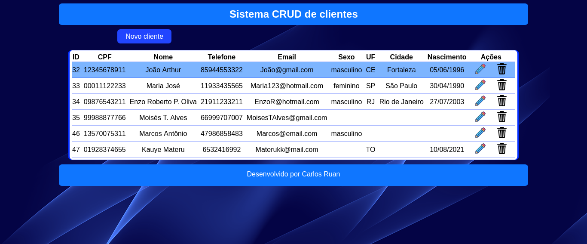
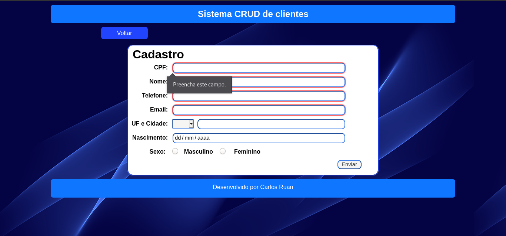
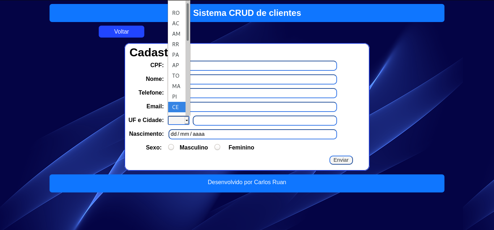
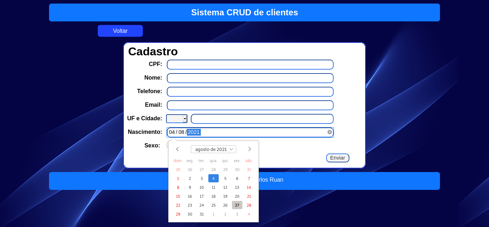
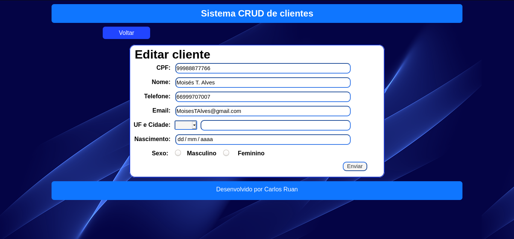
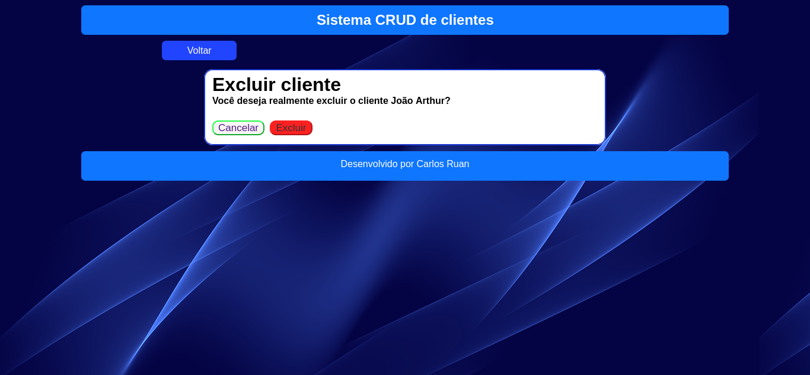
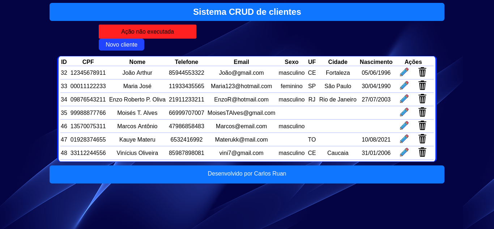
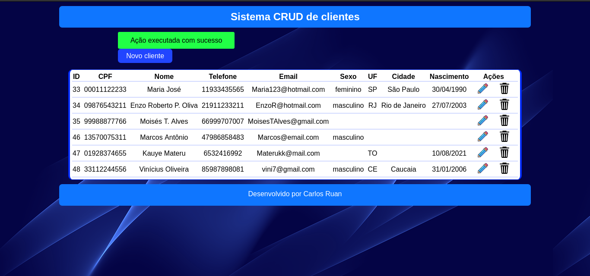

# CRUD_de_Clientes-PHP7-PDO-MYSQL
 Um pequeno projeto pessoal para praticar PHP orientado a objetos usando PDO.
 Códigos no GitHub: https://github.com/CarlosRuanOliveira/CRUD_de_Clientes-PHP-PDO-MYSQL
## Objetivo  
  - Durante as férias, antes do 2º semestre da faculdade, eu usei meu tempo livre para estudar PHP POO e resolvi criar um projeto simples onde usarei HTML, CSS, PDO e MySQL para praticar o que aprendi. ps: Também vou usar o composer com PSR-4 apenas para o autoloading de arquivos e classes php.  
  - Neste projeto farei um CRUD (Create, Read, Update e Delete), ou seja, será possível cadastrar dados de clientes no banco de dados, ler os dados já cadastrados, editar e atualizar estes dados ou deletar completamente o cadastro.  
  - Tem como foco o sistema em si mas usei o CSS para deixar o visual mais bonito.  
  - Criei o banco de dados na minha máquina usando o LAMPP  
## Demonstração  
**Página principal:**  
  - Listagem dos clientes cadastrados e seus respectivos dados.  
  

**Formulário de cadastro dos dados do clientes:**  
  - Os campos CPF, nome, telefone e email são obrigatórios.  
  
  
  

**Formulário de edição dos dados dos clientes**  
  - Puxa os dados do BD e o formulário já vem preenchido com os dados cadastrados.  
  

**Página para confirmação de exclusão do cadastro de um cliente**  
  - Ao precisar de 2 etapas para exclusão de um cadastro, é mais seguro que o usuário não exclua o cliente errado acidentalmente, dessa forma o usuário tem a opção de cancelar a exclusão e voltar para a página principal.  
  
  - Ao ocorrer um erro por qualquer motivo (durante a edição ou exclusão), o sistema retorna para página principal e mostra um alerta.  
  
  - Da mesma forma, quando se tem êxito ele mostra um outro alerta.  
  
